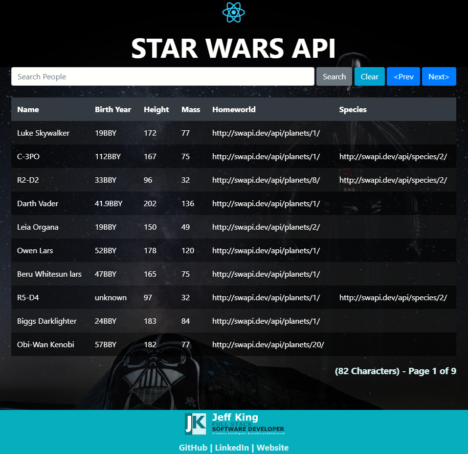

# Star Wars API Application
A complete and searchable list of all Star Wars Characters, and their details.

This project was bootstrapped with [Create React App](https://github.com/facebook/create-react-app).

## Links
[View Application on Heroku](https://immense-tundra-17336.herokuapp.com/)  
[View GitHub Repository](https://github.com/jazfunk/star-wars-api.git)


## Application Image
  


## Summary
Continuing my development experience with React/Node, Bootstrap, and Heroku; diving into the specific character details from the Star Wars online API was a journey reliving my childhood.  It was interesting to see all of the different datum that exists for these fictional characters.  

Utilization of Postman was critical in helping quickly understand the data being pulled in from the API using HTTP Requests.  Being able to instantly see the results allowed me get the desired result faster.

This helped me fully understand the JSON object, and each of the properties that exist.  Right away I noticed the "next" and "previous" URL values, which told me pagination was  built in.

Additionally, I installed and implemented the Axios Library to the project directory.  Axios allows us to communicate with APIs easily in our React apps.

While solidifying my knowledge of the component nature of React, and manipulating state in an appropriate manner, this application came together quickly and made the coding picture much clearer.

I spent some time implementing responsive design, where the application would size properly, regardeless of the device viewing it.  I discovered how to use object width properties relative to the size of the viewport.  Whether on your phone, or 27" triple-monitor setup, it will display proportionally.

With a "Zero Configuration" deployment solution via Heroku, the application is out on the web, for all to enjoy.  

## Prerequisites & Installation
This project requires the following to be installed to run locally:
* [Node](https://nodejs.org/en/)
* Npm

Installing Node will provide access to `npm`.

After Node/Npm installation is complete, run the web server:
```
npm start
```

Run app in the development mode:  Open [http://localhost:3000](http://localhost:3000) to view it in the browser.


## Built With
* [React](https://reactjs.org/docs/getting-started.html)
* [Node](https://nodejs.org/en/)
* [Boostrap v4](https://getbootstrap.com/docs/4.0/getting-started/download/)
* [Axios](https://github.com/axios/axios)
* [Postman](https://www.postman.com/)
* [Star Wars API](https://swapi.dev)

## Deployment
* [Heroku](https://www.heroku.com)

## Author
* **Jeff King** - *Full Stack Software Developer* - [GitHub](https://github.com/jazfunk) | [LinkedIn](https://www.linkedin.com/in/jeffking222/) | [Website](https://jeff-king.net)